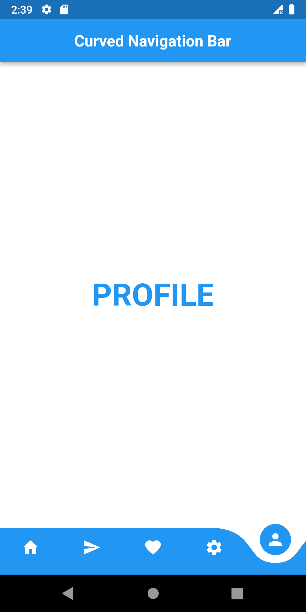

# Curved_navigation_bar mini project

This project is about creating a Fluid bottom Navigation bar in Flutter. 

## Directives

This project was completed under the guide of the youtube tutorial video ["Curved ButtonNavigationBar in Flutter_Bottom Navigation Bar in Flutter"](https://m.youtube.com/watch?v=Z5efE6xobjg)

## Dependencies
- [x] Add the following to your pubspec.yaml file - 
```
dependencies:
    curved_navigation_bar: ^1.0.3
```
- [x] Now run the following in your terminal - 
```
    fluter pub get
 ```

## Help
A few resources to get you started with Flutter

- [Lab: Write your first Flutter app](https://docs.flutter.dev/get-started/codelab)
- [Cookbook: Useful Flutter samples](https://docs.flutter.dev/cookbook)
- The Flutter [online documentation](https://docs.flutter.dev/), which offers tutorials, samples, guidance on mobile development, and a full API reference.


## Screenshots


